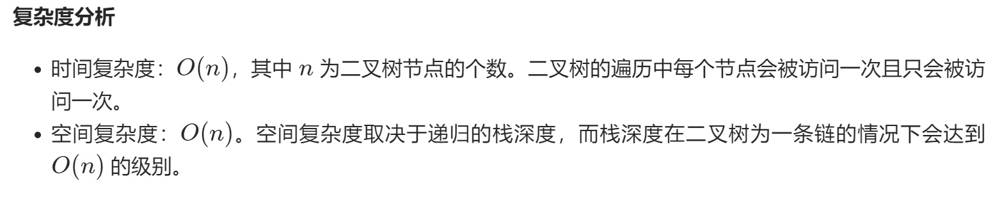

# 标签：树

树的定义：

```java
/**
 * Definition for a binary tree node.
 * public class TreeNode {
 *     int val;
 *     TreeNode left;
 *     TreeNode right;
 *     TreeNode() {}
 *     TreeNode(int val) { this.val = val; }
 *     TreeNode(int val, TreeNode left, TreeNode right) {
 *         this.val = val;
 *         this.left = left;
 *         this.right = right;
 *     }
 * }
 */
```


## 94. 二叉树中序遍历

给定一个二叉树，返回它的*中序* 遍历。

递归遍历解法：

java形式：

```java
class Solution {
    public List<Integer> tmp = new ArrayList();
    public List<Integer> inorderTraversal(TreeNode root) {
        if(root == null) return tmp;
        inorderTraversal(root.left);
        tmp.add(root.val);
        inorderTraversal(root.right);
        return tmp;
        
    }
}
```

### 官方题解

递归解法：

思路和算法：

首先我们需要了解什么是二叉树的中序遍历：按照访问左子树——根节点——右子树的方式遍历这棵树，而在访问左子树或者右子树的时候我们按照同样的方式遍历，直到遍历完整棵树。因此整个遍历过程天然具有递归的性质，我们可以直接用递归函数来模拟这一过程。

```c++
class Solution {
public:
    void inorder(TreeNode* root, vector<int>& res) {
        if (!root) {
            return;
        }
        inorder(root->left, res);
        res.push_back(root->val);
        inorder(root->right, res);
    }
    vector<int> inorderTraversal(TreeNode* root) {
        vector<int> res;
        inorder(root, res);
        return res;
    }
};
```



## 144. 二叉树的前序遍历

递归java：

```java
class Solution {
    List<Integer> result = new ArrayList();
    public List<Integer> preorderTraversal(TreeNode root) {
        if(root == null) return result;
        result.add(root.val);
        preorderTraversal(root.left);
        preorderTraversal(root.right);

        return result;
    }
}
```

## 145. 二叉树的后序遍历

```java
class Solution {
    List<Integer> result = new ArrayList();
    public List<Integer> postorderTraversal(TreeNode root) {
        if(root == null) return result;
        postorderTraversal(root.left);
        postorderTraversal(root.right);
        result.add(root.val);

        return result;
    }
}
```

## 105. 从前序与中序遍历序列构造二叉树

前提：没有重复元素

本题的核心是要理解 ：

* 前序遍历时，根总出现在最前面，然后是左子树，然后是右子树
* 中序遍历时，左子树出现在最前面，然后是根，然后是右子树


java：

```java
class Solution {
    Map<Integer,Integer> indexMap = new HashMap();
    public TreeNode buildTree(int[] preorder, int[] inorder) {
        int n = preorder.length;
        for(int i=0;i<n;i++){
            indexMap.put(inorder[i],i);	
        }
        /*
        	这里使用了散列表的目的是查找根结点在中序遍历序列中的下标时，让O(n)为O(1)常数级别。
        */
        return myTree(preorder,inorder,0,n-1,0,n-1);
    }
    public TreeNode myTree(int []preorder,int []inorder,int pre_start,int pre_end,int in_start,int in_end){
        if(pre_start > pre_end) return null;
        int pre_root = pre_start;   //获取根结点下标	因为前序遍历序列中的第一个元素应该是根结点
        int in_root = indexMap.get(preorder[pre_root]); //获取根结点在中序遍历结果中的下标

        int left_length = in_root - in_start; // 计算左子树长度
        int right_length = in_end - in_root; //计算右子树长度

        TreeNode root = new TreeNode(preorder[pre_root]);     //构造根节点
        root.left = myTree(preorder,inorder,pre_start+1,pre_start+left_length,in_start,in_root-1);
        //左子树在前序遍历中的范围为：[pre_start+1,pre_start+left_length]，即在当前pre_start后一位到长度为左子树长度的结点，在中序遍历中的范围为：[in_start,in_root-1]，即在in_start到根结点所在位置之前一位。
        root.right = myTree(preorder,inorder,pre_start+left_length+1,pre_end,in_root+1,in_end);
        return root;

    }

  
}
```


官方题解：

```java
class Solution {
    private Map<Integer, Integer> indexMap;

    public TreeNode myBuildTree(int[] preorder, int[] inorder, int preorder_left, int preorder_right, int inorder_left, int inorder_right) {
        if (preorder_left > preorder_right) {
            return null;
        }

        // 前序遍历中的第一个节点就是根节点
        int preorder_root = preorder_left;
        // 在中序遍历中定位根节点
        int inorder_root = indexMap.get(preorder[preorder_root]);
        
        // 先把根节点建立出来
        TreeNode root = new TreeNode(preorder[preorder_root]);
        // 得到左子树中的节点数目
        int size_left_subtree = inorder_root - inorder_left;
        // 递归地构造左子树，并连接到根节点
        // 先序遍历中「从 左边界+1 开始的 size_left_subtree」个元素就对应了中序遍历中「从 左边界 开始到 根节点定位-1」的元素
        root.left = myBuildTree(preorder, inorder, preorder_left + 1, preorder_left + size_left_subtree, inorder_left, inorder_root - 1);
        // 递归地构造右子树，并连接到根节点
        // 先序遍历中「从 左边界+1+左子树节点数目 开始到 右边界」的元素就对应了中序遍历中「从 根节点定位+1 到 右边界」的元素
        root.right = myBuildTree(preorder, inorder, preorder_left + size_left_subtree + 1, preorder_right, inorder_root + 1, inorder_right);
        return root;
    }

    public TreeNode buildTree(int[] preorder, int[] inorder) {
        int n = preorder.length;
        // 构造哈希映射，帮助我们快速定位根节点
        indexMap = new HashMap<Integer, Integer>();
        for (int i = 0; i < n; i++) {
            indexMap.put(inorder[i], i);
        }
        return myBuildTree(preorder, inorder, 0, n - 1, 0, n - 1);
    }
}
```


## 106. 从中序和后序遍历序列构造二叉树

本题解题思路类似于从前序与中序遍历序列构造二叉树。

本题的核心是要理解 ：

* 中序遍历时，左子树出现在最前面，然后是根，然后是右子树
* 后序遍历时，根出现在最前面，然后是左子树，然后是右子树

java：

```java
class Solution {
    Map<Integer,Integer> indexMap = new HashMap();
    public TreeNode buildTree(int[] inorder, int[] postorder) {
        int n = inorder.length;
        for(int i=0;i<n;i++){
            indexMap.put(inorder[i],i);
        }
        //构造树
        return myTree(inorder,postorder,0,n-1,0,n-1);
    }

    public TreeNode myTree(int []inorder,int []postorder,int in_start,int in_end,int post_start,int post_end){
        //返回条件
        if(post_start > post_end) return null;

        int post_root = post_end;
        int in_root = indexMap.get(postorder[post_root]);

        //构造根结点
        TreeNode root = new TreeNode(postorder[post_root]);
        //计算左子树长度：
        int left_length = in_root - in_start;
        //计算右子树长度：
        int right_length = in_end - in_root;

        root.left = myTree(inorder,postorder,in_start,in_root-1,post_start,post_start+left_length-1);
        root.right = myTree(inorder,postorder,in_root+1,in_end,post_end-right_length,post_end-1);
        return root;
        
    }
}
```

## 通过不同顺序遍历序列构造二叉树总结：

中序遍历序列是核心，我们通过在前序/后序遍历序列中找到根结点（最左或最右），然后根据这个根结点在中序序列中找到它的左右子树。然后递归这个过程，直到子序列长度为0.

**总结来说，构造二叉树的问题，本质上是一个二叉树的前序遍历问题。**

## 104. 二叉树的最大深度

要计算二叉树的最大深度，即找出左子树和右子树中最大深度+1即可，即$max(l,r)+1$。其中，`l`为左子树最大深度，`r`为右子树最大深度。而左子树/右子树的最大深度也可以通过同样的方式来计算。所以这就是一个递归的算法。

​	java：

```java
class Solution {
    public int maxDepth(TreeNode root) {
        if(root == null){
            return 0;
        }else{
            int left = maxDepth(root.left);
            int right = maxDepth(root.right);
            return Math.max(left,right)+1;
        }
    }
}
```

本质来看，它的形式是后序遍历。

## 111. 二叉树的最小深度（*复习图后再来做）

Java：

```java
class Solution {
    public int minDepth(TreeNode root) {
        if(root==null){
            return 0;
        }else if(root.left==null){	//遇到右斜树
            return minDepth(root.right) + 1;
        }else if(root.right==null){	//遇到左斜树
            return minDepth(root.left) + 1;
        }else{
            int left = minDepth(root.left);
            int right = minDepth(root.right);
            return Math.min(left,right) + 1;
        }
    }
}
```

这个方法不算好。

官方题解中推荐使用BFS或DFS。将在复习了图之后再来看看。